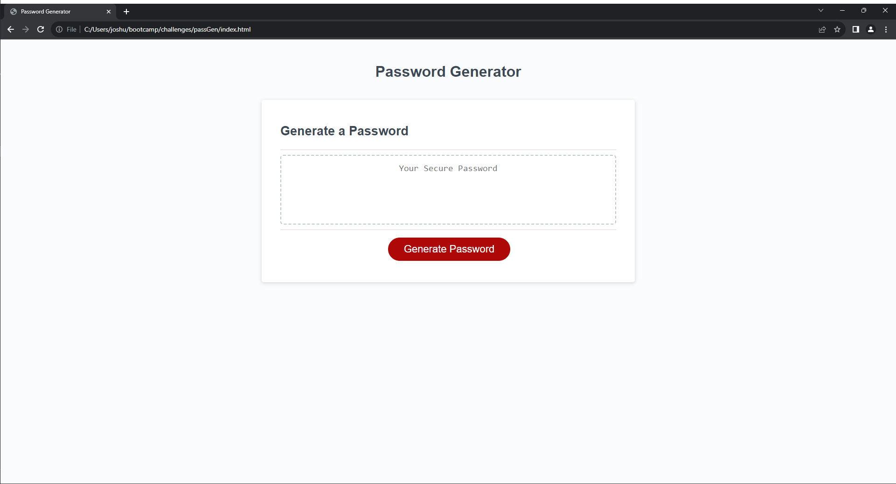
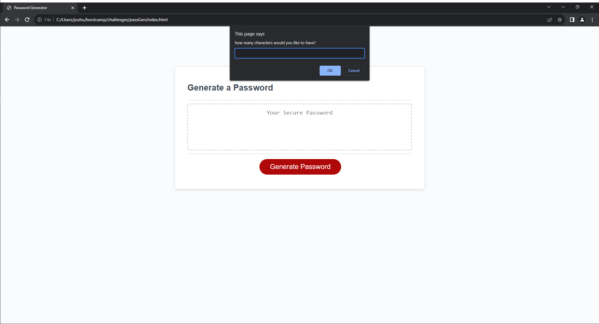
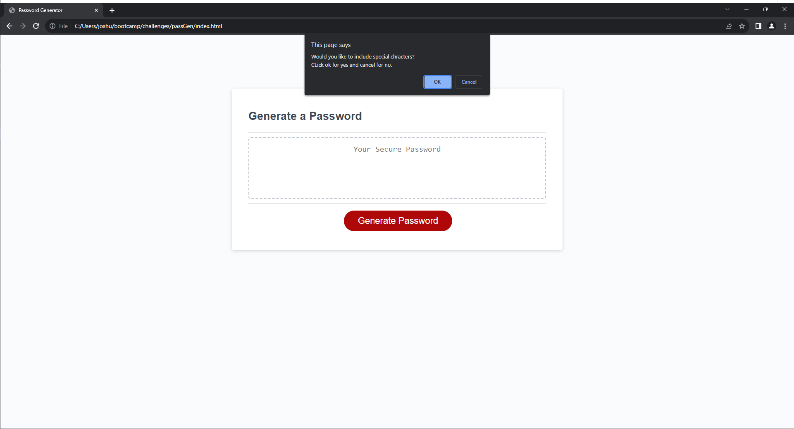
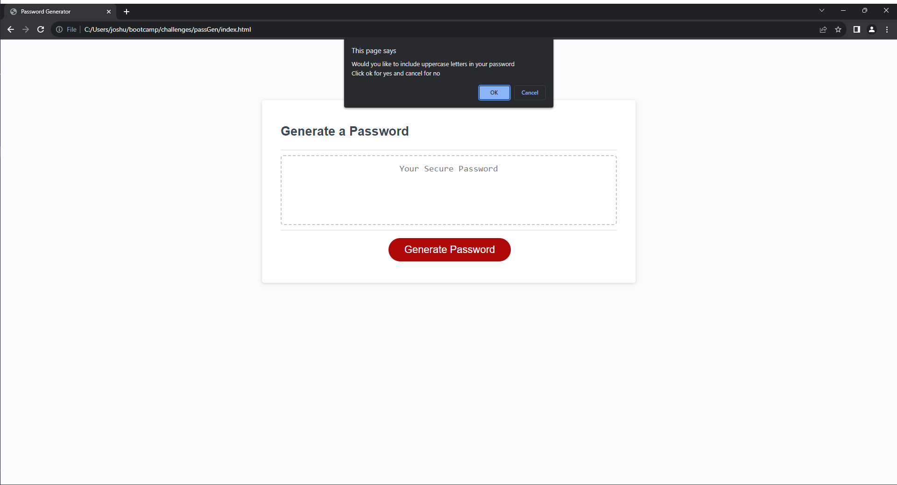

# Password Generator

## Description

- Q: What was the goal of this project?
- A: To use javascript to make a password generator

- Q: What was you biggest challenge for this project?
- A: Making a function to see if the generated password meets all critera specified by the user.

- Q: What did you learn from this project?
- A: How to loop through arrays and that you can store arrays in arrays.

## Installation

N/A

## Usage

### Step 1
Click the Generate Password button

### Step 2
Answer the next five series of prompts to generate your password.

### Step 3
your password will be generated in the text box like so!

## Credits

- Joshua Kennedy-Dedam (https://github.com/MagicianJoshua)

## Disclaimer
This password generator is not to be used for securing anything, and if it is i will not be held responsible
if the password generated is not secure!

